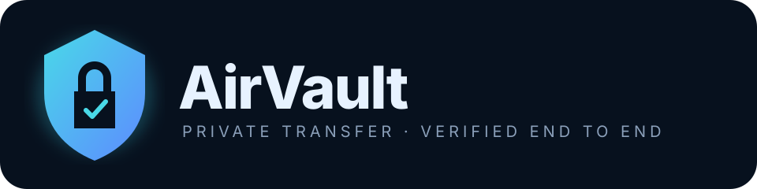
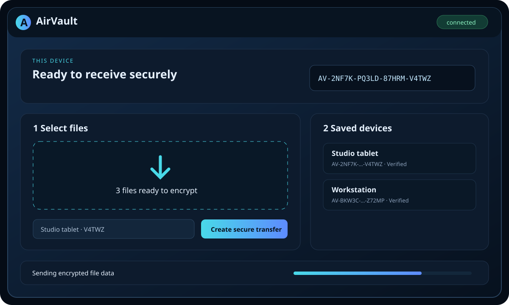
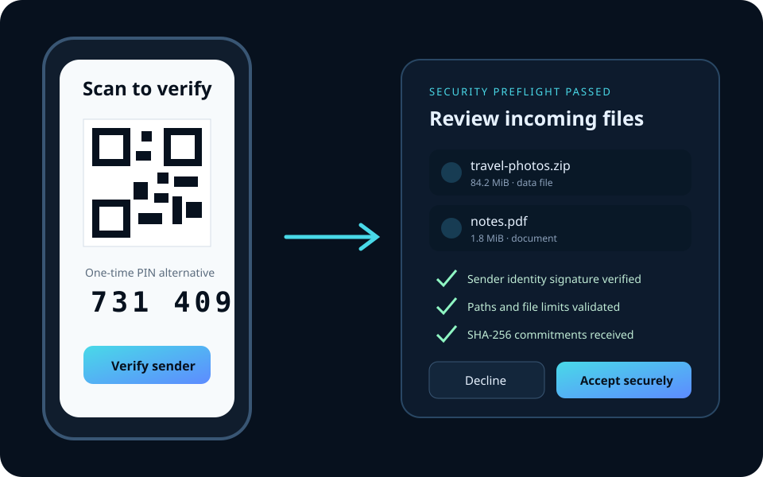
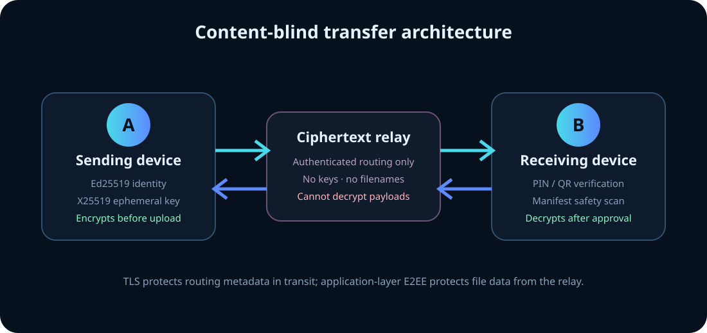
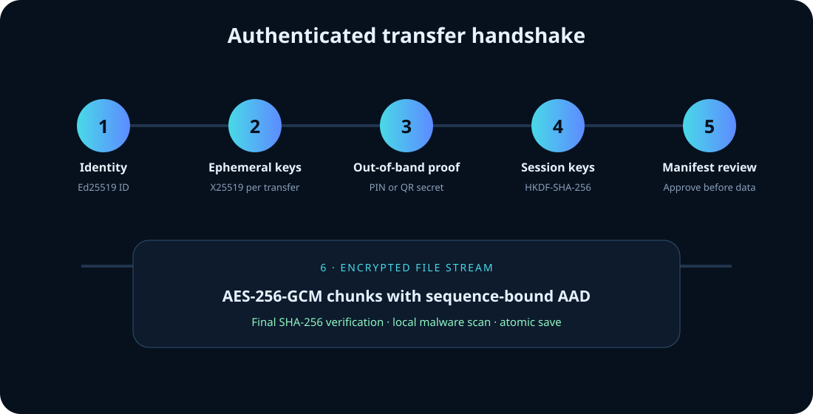

<p align="center">
  
</p>

<p align="center">
  <a href="https://github.com/YanagiKH/AirVault/actions/workflows/ci.yml"></a>
  <a href="https://github.com/YanagiKH/AirVault/actions/workflows/codeql.yml"></a>
  <a href="LICENSE"></a>
</p>

AirVault is an open-source, cross-platform file-transfer application for Windows, Linux, Android phones, and Android tablets. It combines permanent device IDs with per-transfer PIN or QR approval, authenticated end-to-end encryption, a content-blind relay, safe file handling, and optional local malware scanning.

> [!IMPORTANT]
> AirVault has extensive automated tests and defensive controls, but it has not yet completed an independent cryptographic audit. Review the [security guide](docs/SECURITY_GUIDE.md) and [threat model](docs/THREAT_MODEL.md) before high-risk deployment.

## See it in action

### Desktop: select, verify, and send

<p align="center"></p>

1. AirVault creates a stable device ID from an Ed25519 identity key.
2. Add another AirVault ID once; the app permanently saves that peer.
3. Drag several files into the window or use the file picker.
4. Select a saved destination and create the transfer.
5. AirVault displays a six-digit PIN and a QR code. The receiver must provide one of them before encrypted file data is sent.

### Mobile and tablet: scan, review, and receive

<p align="center"></p>

Android uses the system document picker and Storage Access Framework, so AirVault does not request broad storage access. The receiver sees a security-checked manifest before choosing a destination. Every completed file is compared with the sender's SHA-256 commitment.

The Android app supports Android 7.0 (API 24) and newer. AirVault uses the same standard Ed25519 and X25519 PEM formats on Android and desktop; CI verifies an interoperability vector and installs and cold-starts the generated APK on both API 24 and a current Android image.

## Security architecture

<p align="center"></p>

| Control | Implementation |
|---|---|
| Permanent device identity | Ed25519 key pair; `AV-XXXXX-XXXXX-XXXXX-XXXXX` is derived from the public-key fingerprint |
| Dynamic session exchange | Fresh X25519 ephemeral key pair for every transfer |
| Out-of-band authorization | Six-digit PIN with five-attempt lockout, or a 256-bit QR secret |
| Session derivation | HKDF-SHA-256 binds ECDH output, signed transcript, transfer ID, and PIN/QR authorization |
| Content encryption | AES-256-GCM per chunk with deterministic, sequence-bound nonces and authenticated additional data |
| Peer authentication | Signed offer and acceptance; first successful PIN/QR exchange pins the identity key; later key changes are blocked |
| Replay resistance | Expiring signed offers, timestamps, random challenges, one-time relay registration nonces, and strict chunk indexes |
| Safe receive path | Path traversal/reserved-name validation, duplicate detection, file-count and 100 GiB limits, temporary files, SHA-256 verification, and explicit approval |
| Malware scanning | Microsoft Defender on Windows or ClamAV on Linux when available; cryptographic verification always runs |
| Local discovery | Signed multicast beacons are fingerprint-checked before display; a nearby device is saved and its identity key pinned only after explicit user selection |
| Relay privacy | TLS protects routing traffic; application-layer E2EE protects manifests and file bytes |

<p align="center"></p>

The relay necessarily observes limited routing metadata: device IDs, connection times, transfer timing, and approximate ciphertext sizes. It never receives the transfer PIN, QR secret, private keys, plaintext filenames, or plaintext file contents.

## Installation

### Windows

1. Open [Releases](https://github.com/YanagiKH/AirVault/releases).
2. Download `AirVault-<version>-win-x64.exe`.
3. Verify the published SHA-256 checksum and GitHub artifact attestation.
4. Run the installer and choose an installation directory.

An asset ending in `-unsigned.exe` is an automated validation build without Authenticode signing. Use it only for testing; production releases should configure the protected Windows signing secrets described below.

### Linux

Choose either release format:

```bash
# AppImage
chmod +x AirVault-*-linux-x64.AppImage
./AirVault-*-linux-x64.AppImage

# Debian / Ubuntu
sudo apt install ./AirVault-*-linux-x64.deb
```

### Android phones and tablets

1. On an Android 7.0 or newer device, download `AirVault-<version>-android.apk` from [Releases](https://github.com/YanagiKH/AirVault/releases).
2. Verify its checksum and signing certificate fingerprint against the release notes.
3. Allow installation from the browser or file manager used to open the APK.
4. Install it, then restore the “install unknown apps” setting to its previous value.

Google Play distribution can use the same Android App Bundle configuration; the repository release workflow publishes an APK for direct installation.

An asset ending in `-android-debug.apk` uses the isolated `.debug` application ID and a CI debug certificate. It is installable for testing but is not a production update. Production APKs omit the `-debug` suffix and require the protected signing configuration in [docs/INSTALLATION.md](docs/INSTALLATION.md).

AirVault uses Scandit Barcode Capture for a QR-only authorization scanner when `SCANDIT_LICENSE_KEY` is configured at build time. Public or developer builds without a Scandit license automatically retain the built-in QR compatibility scanner, so missing commercial credentials never prevent startup or PIN/QR authorization.

### Build the desktop application from source

Requirements: Node.js 22 or newer, npm 10 or newer, and the platform packaging prerequisites listed by electron-builder.

```bash
git clone https://github.com/YanagiKH/AirVault.git
cd AirVault
npm ci
npm run verify
npm run start:desktop
```

Package installers:

```bash
npm run package:windows -w @airvault/desktop
npm run package:linux -w @airvault/desktop
```

### Build Android from source

Requirements: JDK 17, Android SDK 36, Android Build Tools, and Gradle 9.5. A Scandit license is optional for source builds; set `SCANDIT_LICENSE_KEY` to enable the Scandit QR scanner.

```bash
gradle -p apps/android assembleDebug
```

For a signed release, configure the four signing properties described in [docs/INSTALLATION.md](docs/INSTALLATION.md), then run `assembleRelease`.

### Run a private relay with Docker

```bash
docker build -f services/relay/Dockerfile -t airvault-relay .
docker run --read-only --tmpfs /tmp --cap-drop ALL \
  -p 127.0.0.1:8787:8787 airvault-relay
```

Put the relay behind a TLS reverse proxy, expose it as `wss://relay.example.com`, and configure that address on every device. See [relay deployment](docs/RELAY_DEPLOYMENT.md).

## Repository layout

| Path | Purpose |
|---|---|
| `packages/protocol` | Cross-platform TypeScript identity, handshake, encryption, manifest validation, and protocol tests |
| `apps/desktop` | Sandboxed Electron application for Windows and Linux |
| `apps/android` | Java Android application for phones and tablets |
| `services/relay` | Authenticated, rate-limited WebSocket ciphertext relay |
| `native/core` | C++20/OpenSSL frame, hashing, constant-time, secure-memory, and safe-path primitives with a C API |
| `docs` | Installation, protocol, deployment, threat-model, and security manuals |
| `.github/workflows` | CI, CodeQL, dependency review, and multi-platform release automation |

## Development

```bash
npm ci
npm run typecheck
npm test
npm run build

# Native core
cmake -S native/core -B native/core/build -DCMAKE_BUILD_TYPE=Release
cmake --build native/core/build --parallel
ctest --test-dir native/core/build --output-on-failure

# Android
gradle -p apps/android testDebugUnitTest assembleDebug
```

Read [CONTRIBUTING.md](CONTRIBUTING.md) before opening a change. Security vulnerabilities must be reported privately according to [SECURITY.md](SECURITY.md).

## Documentation

- [Installation and signing](docs/INSTALLATION.md)
- [Security guide](docs/SECURITY_GUIDE.md)
- [Threat model](docs/THREAT_MODEL.md)
- [Wire protocol](docs/PROTOCOL.md)
- [Relay deployment](docs/RELAY_DEPLOYMENT.md)
- [Architecture decisions](docs/ARCHITECTURE.md)

## License

AirVault is licensed under the [Apache License 2.0](LICENSE).
